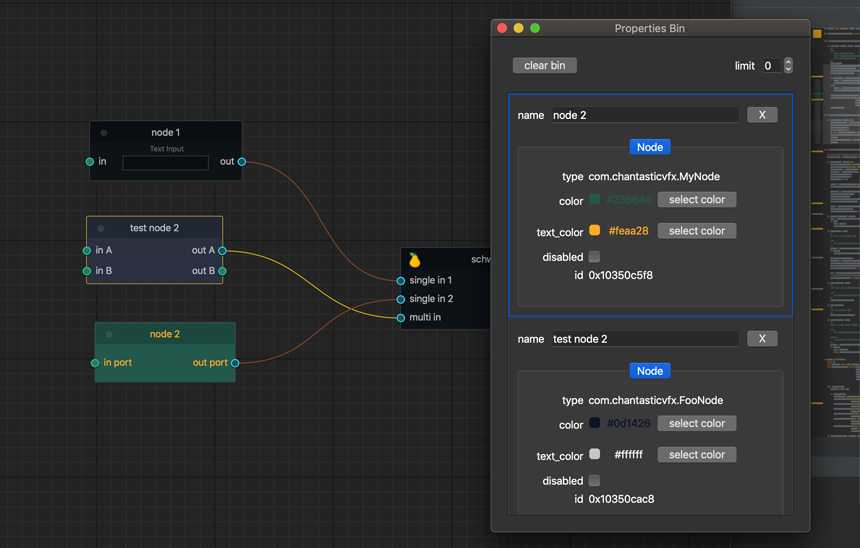
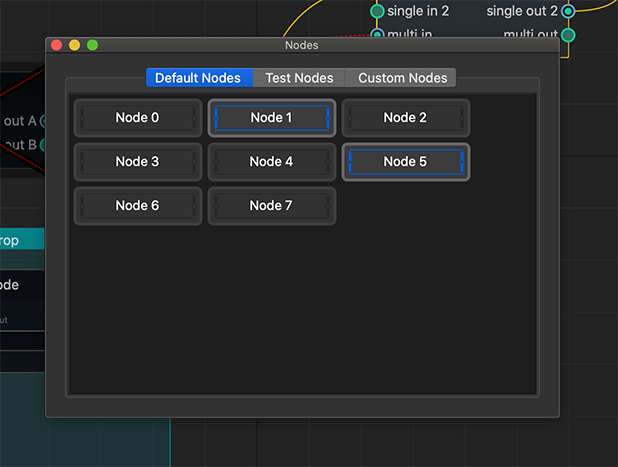
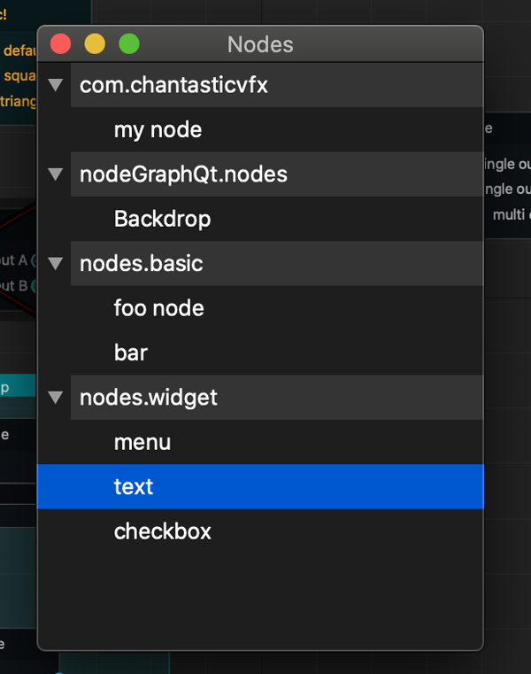
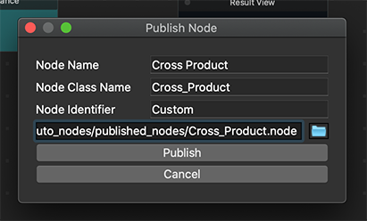

Custom Widgets
##############

Here's a few custom widgets that included with the ``NodeGraphQt`` framework.

Properties Bin
**************

The :class:`NodeGraphQt.PropertiesBinWidget` is a list widget for displaying
and editing a nodes properties.

example

.. code-block:: python
    :linenos:

    from NodeGraphQt import NodeGraph, PropertiesBinWidget

    # create node graph.
    graph = NodeGraph()

    # create properties bin widget.
    properties_bin = PropertiesBinWidget(parent=None, node_graph=graph)
    properties_bin.show()

----

.. autoclass:: NodeGraphQt.PropertiesBinWidget
    :members:
    :exclude-members: property_changed

Nodes Palette
*************

*Implemented on NodeGraphQt:* ``v0.1.7``

The :class:`NodeGraphQt.NodesPaletteWidget` is a widget for displaying all
registered nodes from the node graph in a grid layout with this widget a user
can create nodes by dragging and dropping.

example

.. code-block:: python
    :linenos:

    from NodeGraphQt import NodeGraph, NodesPaletteWidget

    # create node graph.
    graph = NodeGraph()

    # create nodes palette widget.
    nodes_palette = NodesPaletteWidget(parent=None, node_graph=graph)
    nodes_palette.show()

----

.. autoclass:: NodeGraphQt.NodesPaletteWidget
    :members:
    :exclude-members: mimeData,

Nodes Tree
**********

The :class:`NodeGraphQt.NodeTreeWidget` is a widget for displaying all
registered nodes from the node graph with this widget a user can create nodes
by dragging and dropping.

example

.. code-block:: python
    :linenos:

    from NodeGraphQt import NodeGraph, NodeTreeWidget

    # create node graph.
    graph = NodeGraph()

    # create node tree widget.
    nodes_tree = NodeTreeWidget(parent=None, node_graph=graph)
    nodes_tree.show()

----

.. autoclass:: NodeGraphQt.NodeTreeWidget
    :members:
    :exclude-members: mimeData, set_node_factory, property_changed

Publish Node
************

The :class:`NodeGraphQt.NodePublishWidget` is a simple widget for publishing
nodes to a serialized json formatted file.

----

.. autoclass:: NodeGraphQt.NodePublishWidget
    :members: