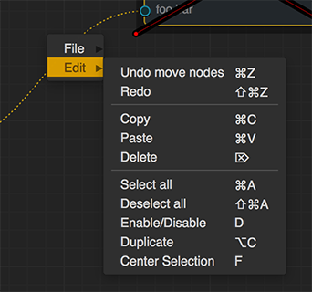

Menu Overview
#############

.. currentmodule:: NodeGraphQt

| Examples for customizing context menus in ``NodeGraphQt``.

Default Context Menu
********************

The :class:`NodeGraphQt.NodeGraph` has a context menu can be accessed with
:meth:`NodeGraph.context_menu`.

It can also be populated it with a config file in ``JSON`` format by using
:meth:`NodeGraph.set_context_menu_from_file`.

| Here's a couple links to the example config file and functions with a few essential menu commands.
| `example JSON config file <https://github.com/jchanvfx/NodeGraphQt/blob/main/examples/hotkeys/hotkeys.json>`_
| `example python hotkey functions <https://github.com/jchanvfx/NodeGraphQt/blob/main/examples/hotkeys/hotkey_functions.py>`_

Adding to the Graph Menu
************************

The ``"graph"`` menu is the main context menu from the NodeGraph object, below
is an example where we add a ``"Foo"`` menu and then a ``"Bar"`` command with
the registered ``my_test()`` function.

.. code-block:: python
    :linenos:

    from NodeGraphQt import NodeGraph

    # test function.
    def my_test(graph):
        selected_nodes = graph.selected_nodes()
        print('Number of nodes selected: {}'.format(len(selected_nodes)))

    # create node graph.
    node_graph = NodeGraph()

    # get the main context menu.
    context_menu = node_graph.get_context_menu('graph')

    # add a menu called "Foo".
    foo_menu = context_menu.add_menu('Foo')

    # add "Bar" command to the "Foo" menu.
    # we also assign a short cut key "Shift+t" for this example.
    foo_menu.add_command('Bar', my_test, 'Shift+t')

Adding to the Nodes Menu
************************

Aside from the main context menu, the NodeGraph also has a nodes menu where you
can override context menus on a per node type basis.

| Below is an example for overriding a context menu for the node type ``"io.github.jchanvfx.FooNode"``

.. code-block:: python
    :linenos:

    from NodeGraphQt import BaseNode, NodeGraph, setup_context_menu

    # define a couple example nodes.
    class FooNode(BaseNode):

        __identifier__ = 'io.github.jchanvfx'
        NODE_NAME = 'foo node'

        def __init__(self):
            super(FooNode, self).__init__()
            self.add_input('in')
            self.add_output('out')

    class BarNode(FooNode):

        NODE_NAME = 'bar node'

    # define a test function.
    def test_func(graph, node):
        print('Clicked on node: {}'.format(node.name()))

    # create node graph and register node classes.
    node_graph = NodeGraph()
    node_graph.register_node(FooNode)
    node_graph.register_node(BarNode)

    # set up default menu commands.
    setup_context_menu(node_graph)

    # get the nodes menu.
    nodes_menu = node_graph.get_context_menu('nodes')

    # here we add override the context menu for "io.github.jchanvfx.FooNode".
    nodes_menu.add_command('Test',
                           func=test_func,
                           node_type='io.github.jchanvfx.FooNode')

    # create some nodes.
    foo_node = graph.create_node('io.github.jchanvfx.FooNode')
    bar_node = graph.create_node('io.github.jchanvfx', pos=[300, 100])

    # show widget.
    node_graph.widget.show()
