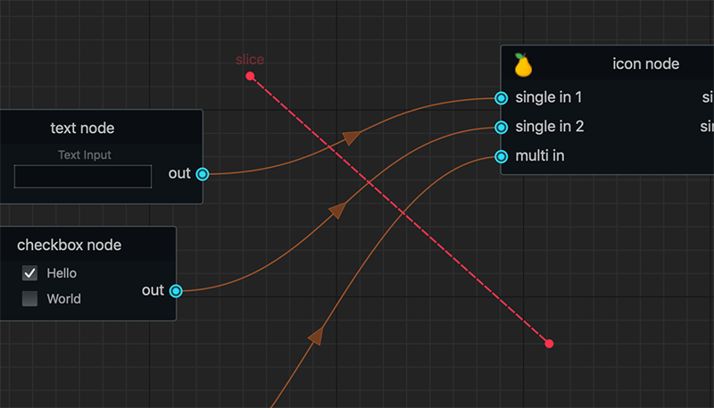

General Overview
################

User interface overview for the node graph.

.. image:: ../_images/overview.png
    :width: 70%

Navigation
**********

+---------------+----------------------------------------------------+
| action        | controls                                           |
+===============+====================================================+
| Zoom In/Out   | ``Alt + MMB + Drag`` or ``Mouse Scroll Up/Down``   |
+---------------+----------------------------------------------------+
| Pan           | ``Alt + LMB + Drag`` or ``MMB + Drag``             |
+---------------+----------------------------------------------------+

Node Selection
**************

.. image:: ../_images/selection.png
    :width: 500px

Nodes can be selected/unselected with the selection marquee using LMB + Drag

Tab Search
**********

.. image:: ../_images/node_search.png
    :width: 269px

Nodes registered in the node graph can be created with the tab search widget.

+-------------------+----------+
| action            | hotkey   |
+===================+==========+
| Toggle Visibility | ``Tab``  |
+-------------------+----------+

Pipe Slicing
************

Connection pipes can be disconnected easily with the built in slice tool.

+---------------------+------------------------------+
| action              | controls                     |
+=====================+==============================+
| Slice Connections   | ``Alt + Shift + LMB + Drag`` |
+---------------------+------------------------------+

Additional Info:
    To disable or enable the pipe slicer see
    :meth:`NodeGraphQt.NodeGraph.set_pipe_slicing`

Getting Started
***************

Here's a basic example snippet for creating two nodes and connecting them together.

.. code-block:: python
    :linenos:

    from Qt import QtWidgets
    from NodeGraphQt import NodeGraph, BaseNode

    # create a node class object inherited from BaseNode.
    class FooNode(BaseNode):

        # unique node identifier domain.
        __identifier__ = 'io.github.jchanvfx'

        # initial default node name.
        NODE_NAME = 'Foo Node'

        def __init__(self):
            super(FooNode, self).__init__()

            # create an input port.
            self.add_input('in', color=(180, 80, 0))

            # create an output port.
            self.add_output('out')

    if __name__ == '__main__':
        app = QtWidgets.QApplication([])

        # create node graph controller.
        graph = NodeGraph()

        # register the FooNode node class.
        graph.register_node(FooNode)

        # show the node graph widget.
        graph_widget = graph.widget
        graph_widget.show()

        # create two nodes.
        node_a = graph.create_node('io.github.jchanvfx.FooNode', name='node A')
        node_b = graph.create_node('io.github.jchanvfx.FooNode', name='node B', pos=(300, 50))

        # connect node_a to node_b
        node_a.set_output(0, node_b.input(2))

        app.exec_()

result:

.. image:: ../_images/example_result.png
    :width: 60%
