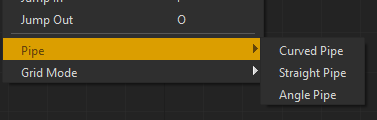

Pipe Overview
#############

Pipe Layouts
************

.. image:: ../_images/pipe_layout_types.gif
        :width: 650px

The :class:`NodeGraphQt.NodeGraph` class has 3 different pipe layout styles as
shown above this can be set easily with the :meth:`NodeGraphQt.NodeGraph.set_pipe_style`
function.

Here's a super simple example snippet for setting the pipe layout style to be angled.

.. code-block:: python
    :linenos:

    from NodeGraphQt import NodeGraph
    from NodeGraphQt.constants import PIPE_LAYOUT_ANGLE

    graph = NodeGraph()
    graph.set_pipe_style(PIPE_LAYOUT_ANGLE)

Constants variables for the 3 different pipe layout styles:

 - ``Curved``: :attr:`NodeGraphQt.constants.PIPE_LAYOUT_CURVED`
 - ``Straight``: :attr:`NodeGraphQt.constants.PIPE_LAYOUT_STRAIGHT`
 - ``Angle``: :attr:`NodeGraphQt.constants.PIPE_LAYOUT_ANGLE`

Note: if you've set up your node graph with the ``NodeGraphQt.setup_context_menu``
is a convenience function then you'll already have the actions to set the pipe
layout under "Edit>Pipe".

