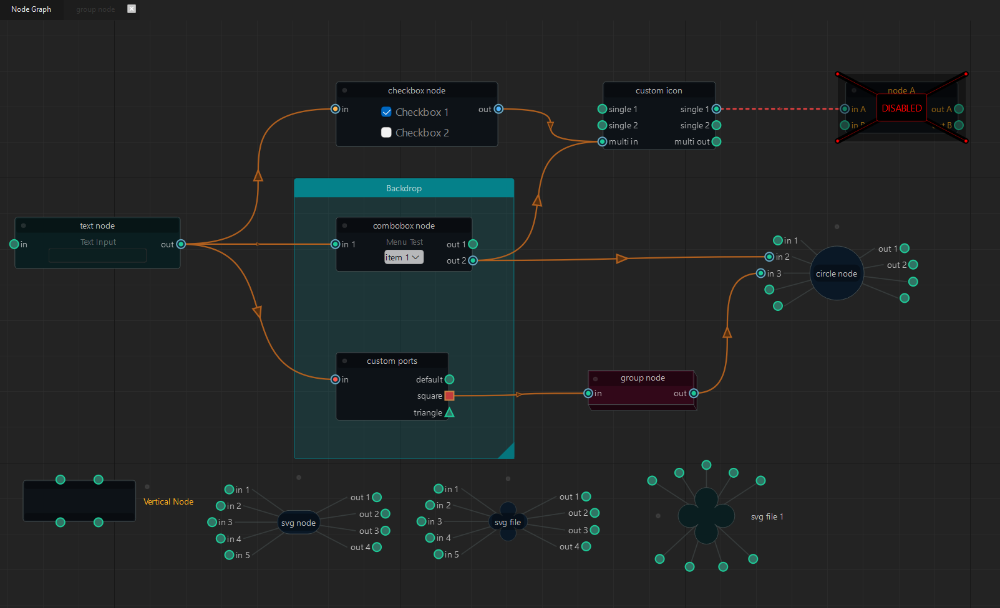

NodeGraphQt |version_str|
#########################

NodeGraphQt a node graph UI framework written in python that can be implemented
and re-purposed into applications supporting PySide2.

| Source: https://github.com/jchanvfx/NodeGraphQt
| Issue Tracker: https://github.com/jchanvfx/NodeGraphQt/issues

----

.. toctree::
    :caption: API Reference
    :name: apitoc
    :maxdepth: 2

    constants
    graph
    nodes/_index_nodes
    port
    menu

.. toctree::
    :caption: Widgets
    :name: wdgtstoc
    :maxdepth: 1

    custom_widgets
    node_widgets

.. toctree::
    :caption: Examples
    :name: exmplstoc
    :maxdepth: 1

    examples/ex_overview
    examples/ex_node
    examples/ex_port
    examples/ex_pipe
    examples/ex_menu
    host_apps/_index_apps
