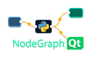

NodeGraphQt |version_str|
#########################

NodeGraphQt a node graph UI framework written in python that can be implemented.

.. image:: _images/screenshot.png

Install
*******

NodeGraphQt is available from the `The Python Package Index (PyPI) <https://pypi.org/project/NodeGraphQt/>`_ so
you can install via ``pip``.

.. code-block::

    pip install NodeGraphQt

or alternatively you can download the source `here <https://github.com/jchanvfx/NodeGraphQt/archive/refs/heads/main.zip>`_.

Getting Started
***************

To get started see the `basic_example.py <https://github.com/jchanvfx/NodeGraphQt/blob/main/examples/basic_example.py>`_
script or checkout the :ref:`General Overview` section.

----

| Source: https://github.com/jchanvfx/NodeGraphQt
| Issues: https://github.com/jchanvfx/NodeGraphQt/issues

.. toctree::
    :hidden:
    :caption: Examples
    :name: exmplstoc
    :maxdepth: 1

    examples/ex_overview
    examples/ex_node
    examples/ex_port
    examples/ex_pipe
    examples/ex_menu
    host_apps/_index_apps

.. toctree::
    :hidden:
    :caption: API Reference
    :name: apitoc
    :maxdepth: 2
    :titlesonly:

    constants
    graphs/_index_graphs
    nodes/_index_nodes
    port
    menu

.. toctree::
    :hidden:
    :caption: Widgets
    :name: wdgtstoc
    :maxdepth: 2

    node_widgets
    builtin_widgets/PropertiesBinWidget
    builtin_widgets/NodesPaletteWidget
    builtin_widgets/NodesTreeWidget
