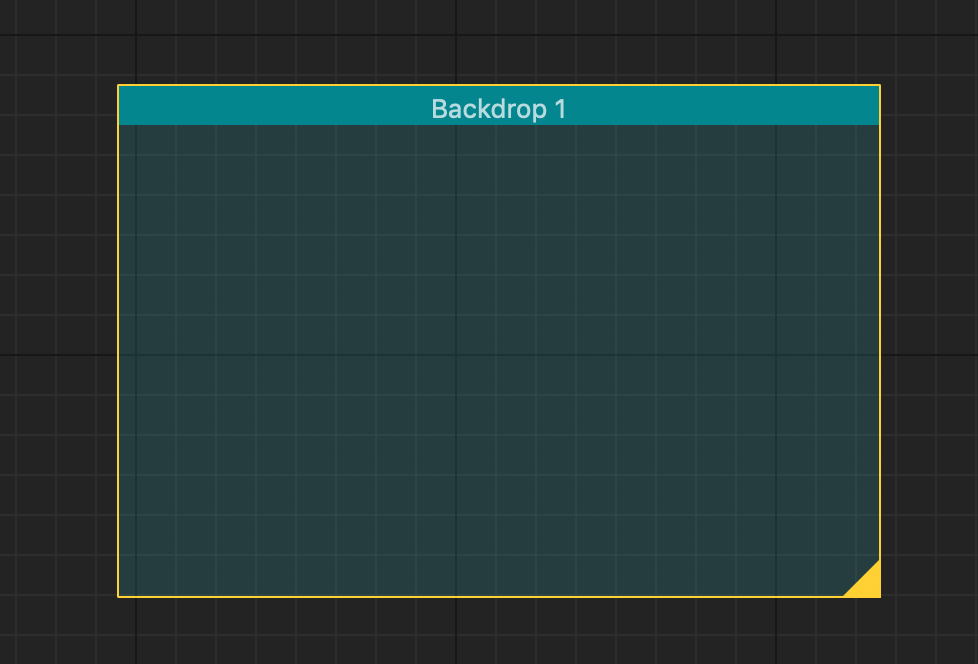

Nodes
*****

Object
======

**Inherited by:** :class:`NodeGraphQt.BaseNode`, :class:`NodeGraphQt.BackdropNode`

The ``NodeObject`` class is the main base class that all nodes inherit from.

----

.. note::
    These two attributes require reimplementing when subclassing any node object.

.. autoattribute:: NodeGraphQt.NodeObject.__identifier__
.. autoattribute:: NodeGraphQt.NodeObject.NODE_NAME

----

.. autoclass:: NodeGraphQt.NodeObject
    :members:
    :exclude-members: model, NODE_NAME

Node
====

**Inherited from:** :class:`NodeGraphQt.NodeObject`

The ``BaseNode`` class is the base class for nodes that allows port connections from one node to another.

.. image:: _images/node.png
    :width: 250px

----

.. autoclass:: NodeGraphQt.BaseNode
    :members:
    :exclude-members: update_model

Backdrop
========

**Inherited from:** :class:`NodeGraphQt.NodeObject`

The ``BackdropNode`` class allows other node object to be nested inside, it's mainly good for grouping nodes together.

----

.. autoclass:: NodeGraphQt.BackdropNode
    :members:

